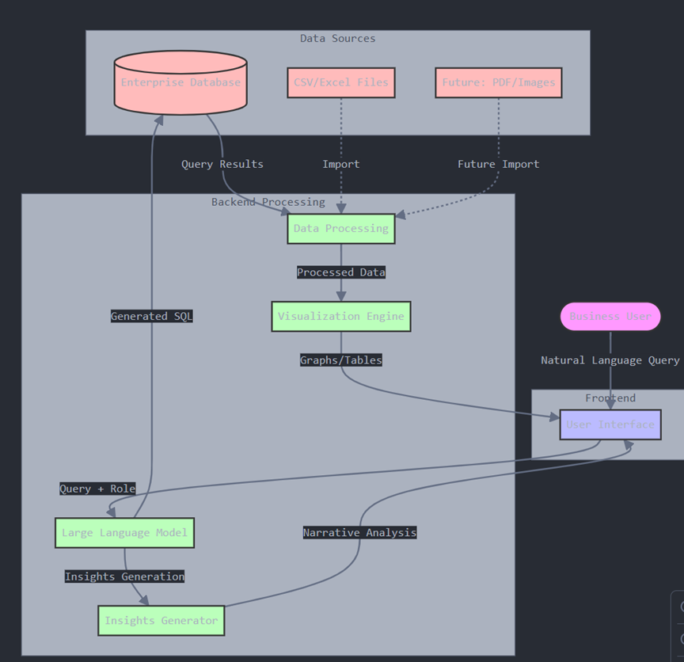
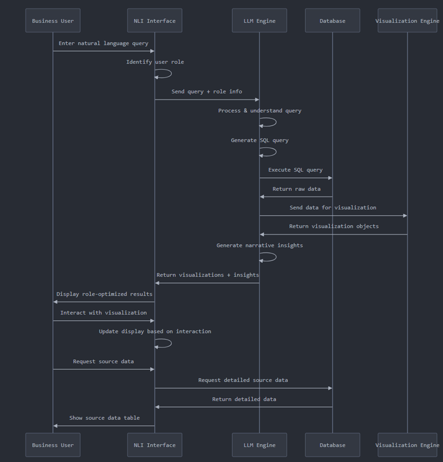

# Natural Language to Insights (NLI)

## Business Intelligence through Conversational AI

This project aims to empower business users to retrieve insights from enterprise data using natural language queries (English). By leveraging a Large Language Model (LLM), the system translates user prompts into SQL queries, extracts the relevant data, and presents it in the form of visualizations (graphs, tables, dashboards) through Power BI or similar tools.

The system is role-aware, ensuring that outputs are tailored to the user's business function, with insights presented in formats most useful to them.

## Goals and Objectives

- Allow users to ask questions in plain English to access business data
- Automatically generate SQL queries from natural language prompts
- Provide visual and written insights through Power BI dashboards
- Support role-based personalization to adapt outputs depending on the user (Sales, Finance, Operations, etc.)
- Enhance executive decision-making through simplified, on-demand analytics

## Process Flow

1. **User Input**: User enters a natural language prompt specifying the analysis
2. **Persona Detection**: System captures the user's role/persona to customize output (e.g., Salesperson, Executive)
3. **Query Generation**: LLM interprets the prompt and generates a corresponding SQL query
4. **Data Retrieval**: Query is executed against the appropriate database/table
5. **Visualization Creation**: Results are presented via graphs, tables, or dashboards with proper titles and annotations
6. **Insight Generation**: The system provides a brief narrative analysis explaining the key insights from the visualization
7. **Source Linking**: Visuals and tables include links to the underlying data for further exploration

## Sample Use Cases

| Role | Prompt | Output |
|------|--------|--------|
| Salesperson | Show me a graph of sales over the last 5 years | Line graph titled '5-Year Sales Trend' with a short performance analysis |
| Executive | Analyze quarterly revenue and give key insights | Bar chart of revenue by quarter with a summary of trends |
| Finance | Provide a table of top 10 customers by revenue | Table listing customers, revenue, and data link |
| Salesperson | Compare this year's sales to last year's in the North region | Side-by-side bar chart with comparison and insights |

## Supported Data Sources

### Current Support
- Database Tables
- CSV, Excel

### Future Support
- PDFs (Single/Multiple)
- Images (Scanned Reports, Charts)
- Unstructured Text
- Multilingual Queries (Hindi, Hinglish)

## Deliverables

- Interactive interface for natural language queries
- Automatic SQL generation and execution
- Dynamic graph/table creation in Power BI
- Narrative insights summarizing data trends
- Role-based output customization
- Linkage to source data for further exploration

## Future Roadmap

- **Phase 1**: Ingest and analyze unstructured files like PDFs and images
- **Phase 2**: Enable multilingual querying (English ↔ Hindi ↔ Hinglish)
- **Phase 3**: Support complex queries with multiple filters, joins, and conditions
- **Phase 4**: Generate multiple graphs and full dashboards from a single prompt
- **Phase 5**: Auto-summarize attached documents alongside visual insights
- **Phase 6**: Integration with external communication tools (e.g., Slack, Teams) for conversational data insights

## Example Scenario (Salesperson Persona)

**Prompt:**
Show me last 5 years of sales in a graph.

**Output:**
- Line graph titled 'Sales from 2019 to 2024'
- Narrative insight: 'Sales have steadily increased with a notable 15% growth in 2023'
- Link to source data for further exploration

## Key Benefits

- Simplifies data access for non-technical users
- Reduces dependency on specialized analysts for routine reporting
- Provides instant insights customized to business roles
- Enhances decision-making with easy-to-understand visuals and summaries
- Scales across departments through flexible file support and query handling

## Getting Started

[Instructions to be added for setup and installation]

## Next Steps

- Finalize technical requirements and data sources
- Begin development of natural language interface
- Plan phased rollout, starting with Sales persona
- Gather feedback to inform future feature development
